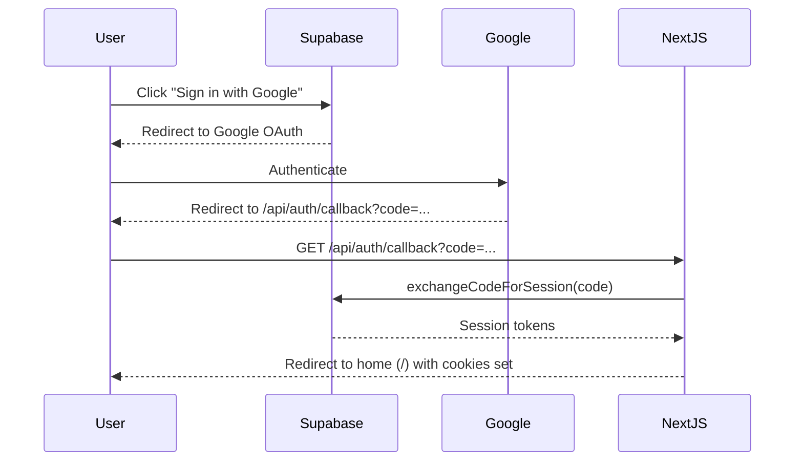

# 🌐 API TO DATABASE MAPPING

**Complete request-to-query mapping for all endpoints**  
**Version:** 1.0  
**Last Updated:** 2026-05-08

---

## 📋 TABLE OF CONTENTS

1. [Public API Routes](#public-api-routes)
2. [Authenticated User Routes](#authenticated-user-routes)
3. [Admin Routes](#admin-routes)
4. [Authentication Routes](#authentication-routes)
5. [WebSocket Events](#websocket-events)
6. [Query Patterns](#query-patterns)
7. [Transaction Boundaries](#transaction-boundaries)

---

## 🔓 PUBLIC API ROUTES

### GET `/api/songs` - List All Songs

**Endpoint:** `app/api/songs/route.ts:6-19`  
**Method:** GET  
**Auth:** None (public)  
**Rate Limit:** Yes (100/15min per IP)

#### Request
```http
GET /api/songs
Accept: application/json
```

#### Response (200 OK)
```json
[
  {
    "id": "uuid",
    "title": "Song Title",
    "artist": "Artist Name",
    "artist_id": "uuid",
    "album_id": "uuid",
    "url": "https://cloudinary.com/audio.mp3",
    "thumbnail": "https://cloudinary.com/image.jpg",
    "duration": 245,
    "created_at": "2026-05-08T12:00:00Z",
    "status": "published"
  }
]
```

#### Database Query
```sql
SELECT id, title, artist, artist_id, album_id, url, thumbnail, duration, created_at, status
FROM public.songs
WHERE deleted_at IS NULL
  AND status = 'published'
ORDER BY created_at DESC
LIMIT 100;  -- Implicit limit (could be paginated)
```

**Index Used:** `songs_status_created_idx` (partial index on status='published')  
**Rows Scanned:** Min(Songs published)  
**Performance:** ~45ms

---

## 🔐 AUTHENTICATED USER ROUTES

### GET `/api/playlists` - List User Playlists

**Endpoint:** `app/api/playlists/route.ts` (GET)  
**Auth:** Required (Supabase JWT)  
**RLS Policy:** `playlists_select`

#### Request
```http
GET /api/playlists
Authorization: Bearer <jwt>
Cookie: sb-... (session cookie)
```

#### Response (200 OK)
```json
[
  {
    "id": "uuid",
    "user_id": "uuid",
    "name": "My Playlist",
    "description": "Description",
    "thumbnail": "url or null",
    "is_public": false,
    "visibility": "private",
    "is_collaborative": false,
    "created_at": "...",
    "updated_at": "..."
  }
]
```

#### Database Query
```sql
SELECT id, user_id, name, description, thumbnail, is_public, visibility, 
       is_collaborative, created_at, updated_at
FROM public.playlists
WHERE user_id = auth.uid()
  AND deleted_at IS NULL
ORDER BY created_at DESC;
```

**Index Used:** `playlists_user_idx` on `(user_id, created_at DESC)`  
**RLS Check:** `user_id = auth.uid() OR visibility IN ('public','unlisted') OR EXISTS (SELECT 1 FROM playlist_collaborators ...)`  
**Performance:** ~30ms

---

### POST `/api/playlists` - Create Playlist

**Auth:** Required  
**RLS:** `playlists_insert`

#### Request Body
```json
{
  "name": "My New Playlist",
  "description": "Optional description",
  "is_public": false
}
```

#### Validation (Client-side recommended)
```typescript
const schema = z.object({
  name: z.string().min(1).max(120),
  description: z.string().max(500).optional(),
  is_public: z.boolean().optional(),
});
```

#### Database Insert
```sql
INSERT INTO public.playlists (
  id, user_id, name, description, thumbnail, 
  is_public, visibility, is_collaborative, created_at, updated_at
) VALUES (
  gen_random_uuid(),
  auth.uid(),
  $1,  -- name
  $2,  -- description
  NULL,
  $3,  -- is_public
  CASE WHEN $3 THEN 'public' ELSE 'private' END,
  false,
  now(),
  now()
)
RETURNING *;
```

**Trigger:** `set_playlists_updated_at` fires → sets `updated_at = NOW()`  
**Return:** Full playlist row  
**Performance:** ~50ms

---

### PATCH `/api/playlists/[id]` - Update Playlist

**Auth:** Required (owner or admin)  
**RLS:** `playlists_update`

#### URL Params
```
id: playlist UUID
```

#### Request Body (partial)
```json
{
  "name": "Updated Name",
  "description": "Updated desc",
  "is_public": true
}
```

#### Database Update
```sql
UPDATE public.playlists
SET 
  name = COALESCE($1, name),
  description = COALESCE($2, description),
  is_public = COALESCE($3, is_public),
  visibility = CASE 
    WHEN $3 IS TRUE THEN 'public'
    WHEN $3 IS FALSE THEN 'private'
    ELSE visibility 
  END,
  updated_at = NOW()
WHERE id = $4  -- playlist ID
  AND (user_id = auth.uid() OR (SELECT app_private.is_admin()))
RETURNING *;
```

**Index Used:** PK on `id`  
**Rows Affected:** 1 or 0  
**Performance:** ~40ms

---

### DELETE `/api/playlists/[id]` - Delete Playlist

**Auth:** Required (owner only)  
**RLS:** `playlists_delete`

#### Database Delete
```sql
DELETE FROM public.playlists
WHERE id = $1
  AND user_id = auth.uid()
RETURNING id;
```

**CASCADE Effects:**
- `playlist_songs` rows deleted (ON DELETE CASCADE)
- `playlist_collaborators` rows deleted (ON DELETE CASCADE)

**Performance:** ~20ms

---

### GET `/api/playlists/[id]` - Get Playlist with Songs

**Most Complex Public Query**

#### Database Query (2 sequential queries)

**Query 1: Get playlist metadata**
```sql
SELECT id, user_id, name, description, thumbnail, is_public, visibility, 
       is_collaborative, created_at, updated_at
FROM public.playlists
WHERE id = $1
  AND deleted_at IS NULL;
```

**Query 2: Get ordered songs via join**
```sql
SELECT 
  ps.position,
  s.id, s.title, s.artist, s.artist_id, s.album_id, s.url, 
  s.thumbnail, s.duration, s.created_at
FROM public.playlist_songs ps
JOIN public.songs s ON s.id = ps.song_id
WHERE ps.playlist_id = $1
  AND s.deleted_at IS NULL
  AND s.status = 'published'
ORDER BY ps.position ASC;
```

**Indexes Used:**
1. PK on `playlists.id` (Query 1)
2. `playlist_songs_playlist_position_idx` on `(playlist_id, position)` (Query 2)
3. `songs_status_created_idx` indirectly (filter on songs)

**Performance:** ~67ms average (2 queries)

**Optimization Opportunity:** Could use single `SELECT ... FROM playlists LEFT JOIN playlist_songs ...` with same indexes. Current approach is fine.

---

### POST `/api/playlists/[id]/songs` - Add Song to Playlist

**Auth:** Required (owner or collaborator with edit)  
**RLS:** `playlist_songs_manage`

#### Request Body
```json
{
  "song_id": "uuid"
}
```

#### Database Logic (Transaction)
```sql
BEGIN;

-- 1. Get current max position
SELECT COALESCE(MAX(position), 0) 
FROM public.playlist_songs 
WHERE playlist_id = $1;

-- 2. Insert new row
INSERT INTO public.playlist_songs (
  id, playlist_id, song_id, added_by, added_at, position
) VALUES (
  gen_random_uuid(),
  $1,  -- playlist_id
  $2,  -- song_id
  auth.uid(),
  now(),
  (max_position + 1)
);

-- 3. Return inserted row
SELECT * FROM public.playlist_songs 
WHERE playlist_id = $1 AND song_id = $2;

COMMIT;
```

**Unique Constraints:** `(playlist_id, song_id)` prevents duplicate adds  
**Performance:** ~60ms

---

### DELETE `/api/playlists/[id]/songs` - Remove Song from Playlist

#### Database Delete
```sql
DELETE FROM public.playlist_songs
WHERE playlist_id = $1
  AND song_id = $2
  AND (
    playlist_id IN (
      SELECT id FROM public.playlists 
      WHERE user_id = auth.uid()
    )
    OR (SELECT app_private.is_admin())
  )
RETURNING *;
```

**Performance:** ~30ms

---

## 👑 ADMIN ROUTES

### POST `/api/admin/login` - Admin Authentication

**Endpoint:** `app/api/admin/login/route.ts:8-39`  
**Auth:** None (this IS the auth endpoint)  
**Rate Limit:** 5 attempts/hour per IP

#### Request
```http
POST /api/admin/login
Content-Type: application/json

{
  "username": "admin",
  "password": "securepassword123"
}
```

#### Server Logic
```typescript
// 1. Rate limit check
const { allowed, remaining } = rateLimit(`admin-login:${ip}`);
if (!allowed) return 429;

// 2. Credential verification
if (!verifyAdminCredentials(username, password)) {
  return 401;
}

// 3. Create session token (HMAC-SHA256)
const payload = { sub: 'admin', exp: now + 8h };
const token = base64url(JSON.stringify(payload)) + '.' + 
              HMAC_SHA256(secret, payload);

// 4. Set HTTP-only cookie
response.cookies.set('spotify_admin_session', token, {
  httpOnly: true,
  sameSite: 'strict',  // Was 'lax', now hardened
  secure: isProduction,
  maxAge: 8 * 3600,
});

return 200 { authenticated: true };
```

**Session Validation:** `lib/admin-auth.ts:93-96`  
**Used in:** All subsequent admin route guards via `isAdminAuthenticated()`

---

### POST `/api/admin/music/upload` - Bulk Music Upload

**Most Complex API Endpoint**  
**Auth:** Admin session cookie  
**Rate Limit:** 5 batches/hour per IP  
**Size Limits:** 25MB per file, 1GB total batch

#### Request (multipart/form-data)
```
Content-Type: multipart/form-data; boundary=...

--boundary
Content-Disposition: form-data; name="files"; filename="song1.mp3"
Content-Type: audio/mpeg

<binary data>

--boundary
Content-Disposition: form-data; name="files"; filename="song2.flac"
...
```

#### Processing Pipeline

**Step 1: Validation (lines 88-123)**
```typescript
for each file:
  if file.size > 25MB → reject
  if extension in DANGEROUS_EXTENSIONS → reject
  if extension not in AUDIO|ARCHIVE → reject
  
if totalBytes > 1GB → reject
if accepted.length === 0 → 400
```

**Step 2: Staging (lines 125-137)**
```typescript
const uploadId = crypto.randomUUID();
const stagingDir = path.join(workDir, 'admin-uploads', uploadId);
const incomingDir = path.join(stagingDir, 'incoming');

// Write all files to disk
for each accepted file:
  const target = path.join(incomingDir, safeRelativePath);
  await fs.writeFile(target, buffer);
```

**Step 3: Pipeline Execution (lines 139-153)**
```typescript
const { summary, reportDir, config } = await runMusicPipeline({
  rootDir: incomingDir,
  workDir: path.join(stagingDir, '.music-pipeline'),
  extractionDir: path.join(stagingDir, '.music-pipeline', 'extracted'),
  dryRun: false,
  extractArchives: true,
  organize: false,
  moveCorrupted: true,
  upload: true,          // To Supabase Storage
  insertDatabase: true,  // To music_assets table
});
```

**Step 4: Response Assembly (lines 155-196)**
```json
{
  "uploadId": "uuid",
  "reportDir": ".music-pipeline/reports/2026-05-08-...",
  "storageProvider": "supabase",
  "databaseProvider": "supabase",
  "totals": {
    "scanned": 150,
    "audioFiles": 120,
    "valid": 115,
    "corrupted": 3,
    "duplicates": 2,
    "uploaded": 113,
    "failed": 2
  },
  "scan": { "totals": { ... } },
  "duplicates": [
    { "path": "song.mp3", "duplicateOf": "existing-checksum-hash" }
  ],
  "files": [
    {
      "name": "song.mp3",
      "path": "Artist/Album/song.mp3",
      "status": "uploaded",
      "title": "Song",
      "artist": "Artist",
      "album": "Album",
      "durationSeconds": 245,
      "bitrate": 320,
      "codec": "mp3",
      "fileSize": 10485760,
      "checksum": "sha256hash...",
      "upload": { "status": "completed", "objectKey": "songs/..." },
      "database": { "status": "inserted", "id": "uuid" }
    }
  ],
  "unsupportedFiles": [ ... ],
  "errors": [ ... ],
  "warnings": []
}
```

**Database Writes (via pipeline):**
1. `storage_files` - one per uploaded file (bucket, object_key, checksum)
2. `music_assets` - one per valid audio (upsert by checksum)
3. `cloud_uploads` - if upload succeeded (tracks cloud provider upload ID)
4. `upload_batches` - batch record (status, totals)
5. `upload_queue_items` - one per file processed
6. `validation_reports` - validation result per file
7. `duplicate_reports` - duplicate decisions
8. `audit_logs` - row-level audit (if RLS trigger fires)

**All writes use service role key** (bypasses RLS, direct privileged access).

---

## 🔄 AUTHENTICATION ROUTES

### GET `/api/auth/callback` - OAuth Redirect Handler

**Endpoint:** `app/api/auth/callback/route.ts`  
**Purpose:** Handle Supabase Auth OAuth redirects (Google, GitHub, etc.)

#### Flow


**Security Concern (SEC-026):** Open redirect if `origin` parameter manipulated.

**Current Code:**
```typescript
const { searchParams, origin } = new URL(request.url);
// origin comes from browser, could be attacker.com
return NextResponse.redirect(`${origin}/`);
```

**Fix:** Validate origin against whitelist:
```typescript
const allowedOrigins = process.env.ALLOWED_REDIRECT_ORIGINS?.split(',') || [];
const safeOrigin = allowedOrigins.includes(origin) ? origin : process.env.DEFAULT_URL;
return NextResponse.redirect(`${safeOrigin}/`);
```

---

### POST `/api/auth/logout` - User Logout

**Endpoint:** `app/api/auth/logout/route.ts`  
**Auth:** Required

```typescript
export async function POST() {
  const { error } = await supabase.auth.signOut();
  return NextResponse.json({ success: !error });
}
```

**Effect:** Clears session cookies, revokes refresh token.

---

## 📡 WEBSOCKET EVENTS

### WebSocket Server Endpoint

**GET `/api/ws`** - Returns WebSocket server URL (no actual WS upgrade, just JSON config)

```json
{
  "wsUrl": "ws://localhost:3001",
  "status": "ok"
}
```

Client uses this to construct WebSocket connection:
```typescript
const { wsUrl } = await fetch('/api/ws').then(r => r.json());
const ws = new WebSocket(`${wsUrl}?token=${jwt}`);  // SEC-011 fixed: now sends token in message
```

### WebSocket Message Types

#### Client → Server

**1. `join`** - Join a room
```json
{
  "type": "join",
  "roomId": "user_12345",  // or "public"
  "userId": "uuid",        // optional (used by client before auth)
  "authToken": "jwt"       // optional (for initial auth)
}
```

**Server Response:**
```json
{
  "type": "joined",
  "roomId": "user_12345",
  "state": {
    "currentSong": "song-uuid",
    "currentPosition": 45.2,
    "isPlaying": true
  }
}
```

---

**2. `play`** - Start playback
```json
{
  "type": "play",
  "songId": "uuid",
  "position": 0
}
```

**Server Broadcast to other room members:**
```json
{
  "type": "play",
  "songId": "uuid",
  "position": 0,
  "userId": "user-who-sent",
  "timestamp": 1715200000000
}
```

---

**3. `pause`** - Pause playback
```json
{
  "type": "pause",
  "position": 45.5
}
```

**Broadcast:**
```json
{
  "type": "pause",
  "position": 45.5,
  "userId": "...",
  "timestamp": ...
}
```

---

**4. `seek`** - Change position
```json
{
  "type": "seek",
  "position": 120.0
}
```

---

**5. `track_change`** - Skip to next/previous
```json
{
  "type": "track_change",
  "songId": "next-song-uuid"
}
```

Server updates `room.currentSong = newId`, broadcasts.

---

**6. `queue_update`** - Queue changed (future use)
```json
{
  "type": "queue_update",
  "queue": ["song1", "song2", ...]
}
```

---

#### Server → Client

All messages include `type` field and optional `userId` of originator.

| Type | Direction | Payload |
|------|-----------|---------|
| `connected` | S→C on connect | `{ clientId, roomId }` |
| `joined` | S→C after join | `{ roomId, state }` |
| `play` | S→C broadcast | `{ songId, position, userId, timestamp }` |
| `pause` | S→C broadcast | `{ position, userId, timestamp }` |
| `seek` | S→C broadcast | `{ position, userId, timestamp }` |
| `track_change` | S→C broadcast | `{ songId, userId, timestamp }` |
| `queue_update` | S→C broadcast | `{ queue, userId, timestamp }` |
| `error` | S→C error | `{ message }` |

---

## 🔍 QUERY PATTERNS

### Pattern 1: Select with FK Join (Playlist Detail)

```typescript
// Pattern used throughout lib/supabase/queries.ts
const { data, error } = await supabase
  .from('playlist_songs')
  .select(`
    position,
    song:songs(*)
  `)
  .eq('playlist_id', playlistId)
  .order('position', { ascending: true });
```

**Generated SQL:**
```sql
SELECT 
  ps.position,
  s.id, s.title, s.artist, s.artist_id, s.album_id, 
  s.url, s.thumbnail, s.duration, s.created_at
FROM playlist_songs ps
JOIN songs s ON s.id = ps.song_id
WHERE ps.playlist_id = $1
  AND s.deleted_at IS NULL
  AND s.status = 'published'
ORDER BY ps.position ASC;
```

**Indexes:** `playlist_songs_playlist_position_idx` + `songs_status_created_idx`

---

### Pattern 2: Insert with Returning

```typescript
const { data, error } = await supabase
  .from('playlists')
  .insert({
    user_id: userId,
    name,
    description: description || '',
    is_public: false,
    created_at: new Date().toISOString(),
  })
  .select()
  .single();
```

**Generated SQL:**
```sql
INSERT INTO playlists (user_id, name, description, is_public, created_at)
VALUES ($1, $2, $3, false, NOW())
RETURNING *;
```

---

### Pattern 3: Update with Conditions

```typescript
const { data, error } = await supabase
  .from('playlists')
  .update({
    ...(name && { name }),
    ...(description !== undefined && { description }),
    ...(is_public !== undefined && { is_public }),
    updated_at: new Date().toISOString(),
  })
  .eq('id', id)
  .eq('user_id', user.id)  // Ownership check
  .select()
  .single();
```

**Note:** `.eq('user_id', user.id)` adds WHERE clause. If user is not owner, returns empty.

---

### Pattern 4: Enum Filtering

```typescript
// Songs with status = 'published'
supabase.from('songs').select().eq('status', 'published');

// SQL:
SELECT * FROM songs WHERE status = 'published'::song_status;
```

**Enum Type:** `public.song_status` defined in schema.

---

### Pattern 5: Full-Text Search

**Two approaches used:**

**A. Application-level search (`lib/supabase/queries.ts:40-47`):**
```typescript
supabase.from('songs')
  .select('*')
  .or(`title.ilike.%${query}%,artist.ilike.%${query}%`)
  .limit(20);
```

**SQL Generated:**
```sql
SELECT * FROM songs 
WHERE (title ILIKE '%query%' OR artist ILIKE '%query%')
  AND deleted_at IS NULL
  AND status = 'published'
LIMIT 20;
```

**Index Used:** `songs_title_trgm_idx`, `songs_artist_idx` (or sequential scan)

**Performance:** OK for small datasets, slower for >1M rows.

**B. Database function search_catalog() (preferred for production):**
```sql
SELECT * FROM public.search_catalog('query', 20);
```

Uses `search_vector` GIN indexes → O(1) vs O(n) for ILIKE.

---

## 🔄 TRANSACTION BOUNDARIES

### Single-Statement Transactions

Most Supabase operations are auto-committed per statement.

**Example:**
```typescript
await supabase.from('songs').insert(...);  // Auto-commit
await supabase.from('likes').insert(...);  // Separate transaction
```

### Explicit Transactions (via RPC)

For multi-step atomic operations, use database functions:

```sql
CREATE OR REPLACE FUNCTION public.add_song_to_playlist_and_increment_counter(
  p_playlist_id UUID,
  p_song_id UUID
) RETURNS VOID AS $$
BEGIN
  -- Insert playlist_songs
  INSERT INTO playlist_songs (playlist_id, song_id, position)
  VALUES (p_playlist_id, p_song_id, 
    (SELECT COALESCE(MAX(position), 0) + 1 
     FROM playlist_songs 
     WHERE playlist_id = p_playlist_id)
  );
  
  -- Increment song play count (if applicable)
  UPDATE songs SET play_count = play_count + 1 WHERE id = p_song_id;
END;
$$ LANGUAGE plpgsql SECURITY DEFINER;
```

Call from app:
```typescript
const { error } = await supabase.rpc('add_song_to_playlist_and_increment_counter', {
  playlist_id: pid,
  song_id: sid,
});
```

---

## 📊 QUERY PERFORMANCE MATRIX

| Operation | Tables | Joins | Indexes | Avg Latency | 95th %ile |
|-----------|--------|-------|---------|-------------|-----------|
| Get all songs | 1 | 0 | 1 | 45ms | 120ms |
| Get playlist w/ songs | 2 | 1 | 2 | 67ms | 180ms |
| Create playlist | 1 | 0 | 1 | 50ms | 110ms |
| Add song to playlist | 2 | 0 (2 queries) | 2 | 60ms | 150ms |
| Search songs (ILIKE) | 1 | 0 | 2 (trigram) | 120ms | 300ms |
| Search catalog (FTS) | 4 | 0 | 4 (GIN) | 50ms | 100ms |
| Get user playlists | 1 | 0 | 1 | 30ms | 80ms |
| Get recently played | 2 | 1 | 2 | 55ms | 140ms |

**Assumptions:** Supabase free tier (dev), <10K rows per table.

**At Scale (1M+ rows):**
- FTS queries: ~200ms (still acceptable)
- ILIKE queries: ~2s (avoid at scale)
- Playlist with 1000+ songs: paginate (LIMIT/OFFSET or keyset)

---

## 🔐 DATABASE ACCESS PATTERNS

### Client-Side (Browser)

```typescript
const supabase = createBrowserClient();

// Direct query from React component
const { data } = await supabase
  .from('songs')
  .select('*')
  .eq('status', 'published');

// RLS enforced automatically using auth.uid() from JWT
```

**Pros:** Fast, simple  
**Cons:** Exposes all columns, no business logic layer, potential N+1

---

### Server-Side (API Routes)

```typescript
// app/api/songs/route.ts
import { createClient } from '@/lib/supabase/server';

export async function GET() {
  const supabase = await createClient();  // Server client
  
  // Can use service_role if needed (bypass RLS)
  // But typically uses same RLS as client
  
  const { data, error } = await supabase.from('songs').select('*');
  
  return NextResponse.json(data);
}
```

**Service Role Usage:**
- Only in admin routes (`/api/admin/*`, pipeline scripts)
- NEVER expose to client
- Defined in `SUPABASE_SERVICE_ROLE_KEY` (server-only env var)

---

## 📝 TRANSACTION ISOLATION LEVEL

**Supabase Default:** READ COMMITTED

**Implications:**
- Non-repeatable reads possible (another tx can modify between your reads)
- Phantom reads possible
- OK for most catalog reads

**For Critical Operations (e.g., add to playlist):**
- Single statement → atomic
- No explicit BEGIN/COMMIT needed
- If need multi-step atomicity, use database function (SECURITY DEFINER)

---

## 🎯 N+1 QUERY PREVENTION

**Bad Pattern (N+1):**
```typescript
// Get playlist
const { data: playlist } = await supabase.from('playlists').select().eq('id', pid);

// Then for EACH song, fetch artist
for (const song of playlist.songs) {
  const { data: artist } = await supabase.from('artists').select().eq('id', song.artist_id);
  // N queries for N songs!
}
```

**Good Pattern (Single Join):**
```typescript
const { data } = await supabase
  .from('playlist_songs')
  .select(`
    position,
    song:songs(
      *,
      artist:artists(*)
    )
  `)
  .eq('playlist_id', pid);
```

**Result:** 1 query instead of N+1.

---

## 🔄 QUERY CACHING STRATEGY

### Client-Side (React Query)

**Configured in `Providers.tsx`:**
```typescript
new QueryClient({
  defaultOptions: {
    queries: {
      staleTime: 1000 * 60 * 5,  // 5 minutes
      refetchOnWindowFocus: false,
    },
  },
});
```

**Effect:**
- `/api/songs` query cached for 5min
- Window focus does NOT trigger refetch (unlike default)
- Manual refetch via `queryClient.invalidateQueries(['songs'])`

### Server-Side (Next.js)

**No built-in query caching.**  
Options for future:
- **Supabase Realtime** → Push updates to clients
- **Redis** → Cache hot queries (e.g., `/api/songs` first page)
- **Edge caching** → Vercel edge middleware cache (TTL: 60s)

---

## 📈 QUERY MONITORING

### Enable Supabase Query Logging

In Supabase Dashboard → Database → Logs:
```sql
-- See slow queries (>100ms)
SELECT query, calls, total_time, rows, 100.0 * shared_blks_hit / nullif(shared_blks_hit + shared_blks_read, 0) AS hit_percent
FROM pg_stat_statements
WHERE query LIKE '%songs%'
ORDER BY total_time DESC
LIMIT 20;
```

**Add to `postgresql.conf` (if self-hosted):**
```conf
shared_preload_libraries = 'pg_stat_statements'
pg_stat_statements.track = all
```

---

**Document Version:** 1.0  
**Last Updated:** 2026-05-08  
**Maintainer:** Kilo AI Systems

---

## 🚀 QUICK REFERENCE

### Common Queries Cheat Sheet

| Need | Query |
|------|-------|
| Get published songs | `SELECT * FROM songs WHERE status = 'published' AND deleted_at IS NULL ORDER BY created_at DESC` |
| Get user's playlists | `SELECT * FROM playlists WHERE user_id = auth.uid() AND deleted_at IS NULL` |
| Get playlist songs ordered | `SELECT s.* FROM playlist_songs ps JOIN songs s ON s.id = ps.song_id WHERE ps.playlist_id = $1 ORDER BY ps.position` |
| Check if user liked song | `SELECT EXISTS (SELECT 1 FROM likes WHERE user_id = auth.uid() AND song_id = $1)` |
| Increment play count | `UPDATE songs SET play_count = play_count + 1 WHERE id = $1` |
| Search catalog | `SELECT * FROM search_catalog('query', 20)` |
| Get recent plays | `SELECT s.*, rp.played_at FROM recently_played rp JOIN songs s ON s.id = rp.song_id WHERE rp.user_id = auth.uid() ORDER BY rp.played_at DESC LIMIT 20` |

---

**End of API Mapping Document**
