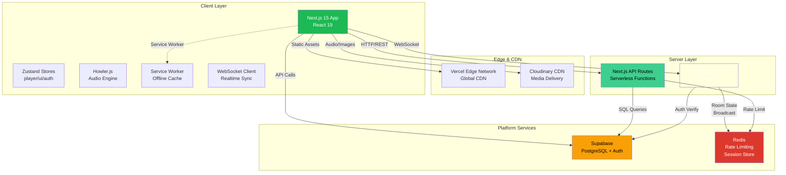
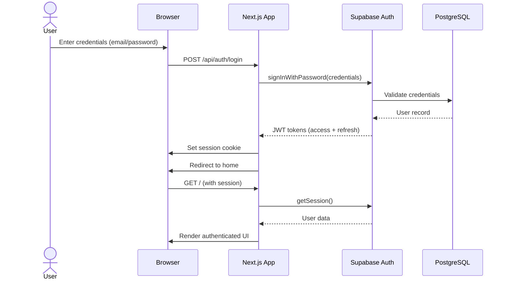
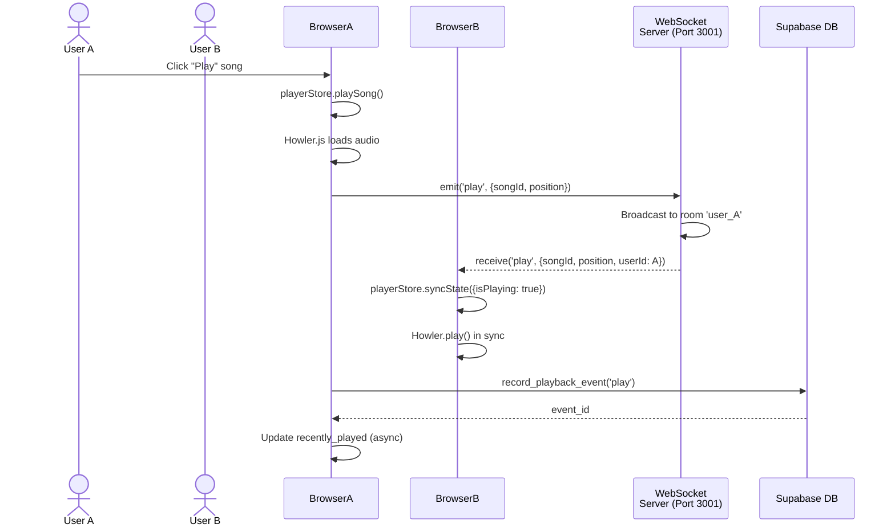
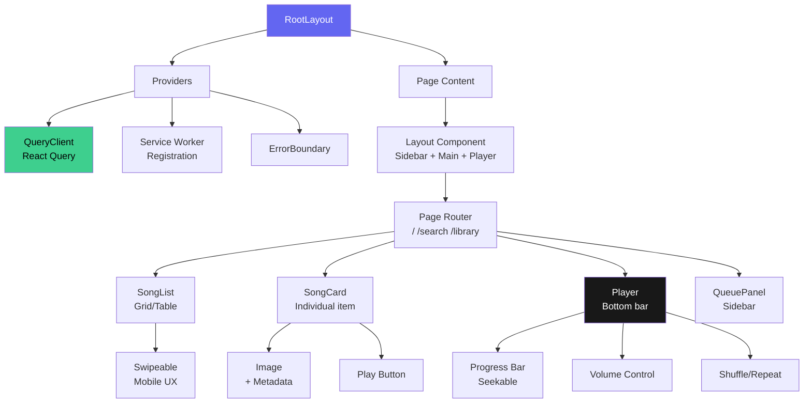
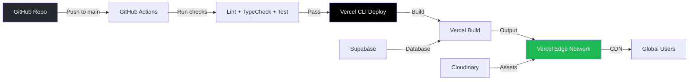
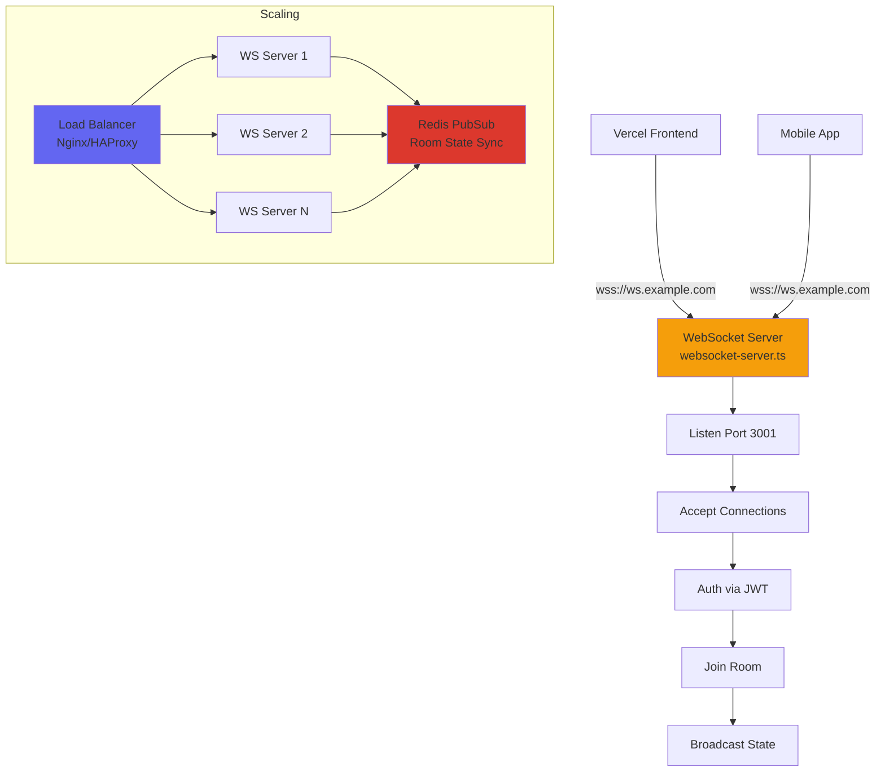

# 🏗️ SYSTEM ARCHITECTURE DIAGRAMS

**Project:** Spotify Clone  
**Version:** 0.1.0  
**Architecture:** Client-Server with WebSocket Realtime Sync  
**Stack:** Next.js 15, TypeScript, Supabase, Cloudinary

---

## 📐 HIGH-LEVEL SYSTEM ARCHITECTURE



---

## 🔄 DATA FLOW DIAGRAMS

### 1. User Authentication Flow



**Key Security Points:**
- Password never stored in client (Supabase handles hashing with bcrypt/argon2)
- JWT tokens stored in HTTP-only cookies (client-side) + Zustand persistence
- Session automatically refreshed by Supabase
- RLS enforced on all database queries

---

### 2. Audio Playback & Real-time Sync Flow



**Real-time Room Model:**
```
Room = 'user:{userId}'  // Each user has own room
       'public'         // Public listening room (future)
       'party:{id}'     // Shared listening sessions

Clients in same room receive:
- play / pause
- seek (position changes)
- track_change (next/prev)
- queue_update
```

---

### 3. Admin Music Upload Pipeline Flow

```mermaid
flowchart TD
    A[Admin visits<br/>/admin/music] --> B{Is authenticated?}
    B -- No --> C[Redirect to<br/>admin login]
    B -- Yes --> D[Show upload UI]
    D --> E[Select files<br/>Drag & Drop / Folder]
    E --> F[POST /api/admin/music/upload<br/>multipart/form-data]
    F --> G{Server validation}
    G -->|Size/type checks| H[Reject: 400]
    G -->|Pass| I[Write to staging dir]
    I --> J[runMusicPipeline()]
    J --> K[Scanner: find files]
    K --> L[Extractor: unpack archives]
    L --> M[Validator: metadata extract]
    M --> N{Dedupe?}
    N -- Yes --> O[Mark as duplicate<br/>Skip upload]
    N -- No --> P[Uploader: send to<br/>Supabase Storage]
    P --> Q[Database: insert<br/>music_assets]
    Q --> R[Return summary]
    R --> S[UI shows results<br/>Success/Fail count]
    H --> T[UI displays error]
    O --> S
    
    subgraph "Pipeline Stages"
        K --> L --> M --> N --> P --> Q
    end
    
    style A fill:#e1f5e1
    style F fill:#ffefba
    style J fill:#ffefba
    style S fill:#d4edda
    style H fill:#f8d7da
```

---

### 4. Song Search & Discovery Flow

```mermaid
flowchart LR
    A[User types<br/>search query] --> B[Debounce 300ms]
    B --> C[GET /api/search?q=query]
    C --> D[Supabase<br/>search_catalog()]
    D --> E[Full-text search<br/>songs.artists.albums]
    E --> F[Rank by<br/>ts_rank()]
    F --> G[Return top 20<br/>each entity]
    G --> H[UI displays<br/>songs/albums/artists]
    
    subgraph "Database Side"
        D --> E
        E --> F
    end
```

**Query Executed:**
```sql
SELECT * FROM public.search_catalog('beatles', 20);
-- UNION ALL across songs, artists, albums, playlists
-- Each filtered by search_vector @@ query
-- Ordered by ts_rank DESC
-- LIMITED by result_limit
```

---

## 🖥️ FRONTEND ARCHITECTURE

### Component Hierarchy



### State Management (Zustand)

```mermaid
graph LR
    A[.playerStore] --> B[currentSong<br/>Song | null]
    A --> C[queue<br/>Song[]]
    A --> D[isPlaying<br/>boolean]
    A --> E[volume<br/>number]
    A --> F[progress<br/>number]
    A --> G[shuffle<br/>boolean]
    A --> H[repeat<br/>mode]
    
    I[authStore] --> J[user<br/>User | null]
    I --> K[session<br/>AuthSession | null]
    I --> L[isAuthenticated<br/>boolean]
    
    M[uiStore] --> N[showQueue<br/>boolean]
    M --> O[currentView<br/>string]
    M --> P[modals<br/>object]
    
    Q[React Query<br/>TanStack] --> R[Server State<br/>songs/playlists]
    
    A -->|Persisted| S[localStorage]
    I -->|Persisted| S
    Q -->|Cached| T[Memory]
    
    style A fill:#ff6b6b
    style I fill:#4ecdc4
    style M fill:#45b7d1
    style Q fill:#96ceb4
```

**Store Communication:**
- `playerStore` → dispatches WebSocket events
- `authStore` → provides auth context to API routes
- `uiStore` → controls layout visibility
- React Query → fetches catalog data, cached

---

## 🌐 NETWORK ARCHITECTURE

### Request Flow Through Stack

```
┌─────────────────────────────────────────────────────────────────────┐
│                            Browser (Client)                         │
│  ┌─────────────────────────────────────────────────────────────────┐ │
│  │ Next.js App (React 19)                                          │ │
│  │  • Components: Player, Sidebar, SongCard, Playlist              │ │
│  │  • Hooks: useWebSocket, useServiceWorker                        │ │
│  │  • Stores: playerStore, authStore (Zustand)                     │ │
│  └─────────────────────────────────────────────────────────────────┘ │
└──────────────────────────────┬──────────────────────────────────────┘
                               │ HTTPS (port 443)
                               ▼
┌─────────────────────────────────────────────────────────────────────┐
│                     Vercel Edge Network / CDN                       │
│  • Static asset caching (JS, CSS, images)                          │
│  • Edge function routing (/api/* → serverless)                     │
│  • TLS termination                                                 │
└──────────────────────────────┬──────────────────────────────────────┘
                               │
                ┌──────────────┴──────────────┐
                │                             │
                ▼                             ▼
┌───────────────────────┐      ┌──────────────────────────┐
│ Next.js Serverless    │      │ WebSocket Server         │
│ API Routes            │      │ (Port 3001)              │
│ • /api/songs          │      │                          │
│ • /api/playlists      │      │ Room Manager             │
│ • /api/admin/*        │      │ Event Router             │
│ • /api/auth/*         │      │ Broadcast Engine         │
└───────────┬───────────┘      └───────────┬──────────────┘
            │                              │
            │ PostgreSQL Queries            │ WebSocket Messages
            ▼                              ▼
┌───────────────────────┐      ┌──────────────────────────┐
│   Supabase            │      │   Redis (Optional)       │
│   • PostgreSQL        │◄─────┤   • Rate limiting        │
│   • Auth              │      │   • Session store        │
│   • Storage           │      │   • Room state (future)  │
└───────────────────────┘      └──────────────────────────┘
```

---

## 🔌 API ROUTES ARCHITECTURE

### Route Structure

```
app/api/
├── songs/
│   └── route.ts          GET/POST    Public catalog + admin create
├── playlists/
│   ├── route.ts          GET/POST    List + create
│   └── [id]/
│       └── route.ts      GET/PATCH/DELETE  Detail + modify
├── playlist/[id]/
│   └── songs/
│       └── route.ts      POST/DELETE Add/remove songs
├── admin/
│   ├── login/
│   │   └── route.ts      POST        Admin authentication
│   ├── logout/
│   │   └── route.ts      POST        Admin logout
│   ├── session/
│   │   └── route.ts      GET         Check admin session
│   ├── music/
│   │   ├── upload/
│   │   │   └── route.ts  POST        Upload songs (multipart)
│   │   └── analyze/
│   │       └── route.ts  POST        Dry-run analysis
├── auth/
│   ├── callback/
│   │   └── route.ts      GET         Supabase OAuth callback
│   └── logout/
│       └── route.ts      POST        User logout
└── ws/
    └── route.ts          GET         WebSocket URL config
```

### Middleware Chain

```
Request → NextMiddleware (CORS) → Route Handler → Response
         ↓
    [API routes only]
         ↓
    Auth Check (inline)
         ↓
    Rate Limit (inline)
         ↓
    Business Logic
         ↓
    Supabase Query
         ↓
    JSON Response
```

**Recommended Refactor (Future):**
```typescript
// lib/middleware.ts
export const withAuth = (handler) => async (req) => { ... }
export const withRateLimit = (handler, keyFn) => async (req) => { ... }
export const withAdmin = (handler) => async (req) => { ... }

// Usage:
export const GET = withAuth(withRateLimit(async (req, user) => {
  // Handler code
}, 'songs-list'));
```

---

## 🗃️ DATABASE ACCESS LAYERS

### Data Access Pattern

```
Component (React)
    ↓ calls
Hook (useSongs, usePlaylist)
    ↓ uses
Query Function (lib/supabase/queries.ts)
    ↓ calls
Supabase Client (browser or server)
    ↓ generates
PostgreSQL Query
    ↓ executes
Supabase Database
```

**Client vs Server:**

| Aspect | Client (Browser) | Server (API Route) |
|--------|------------------|--------------------|
| Client | `@supabase/ssr` browser client | `@supabase/ssr` server client |
| Auth | `supabase.auth.getSession()` | `cookies()` → `createServerClient()` |
| RLS | Enforced (same) | Enforced (same) |
| Service Role | ❌ Never used | ✅ Available in server routes |
| Queries | Direct from React | Wrapped in `withAuth` middleware |

---

## 🔐 AUTHENTICATION & AUTHORIZATION ARCHITECTURE

### Dual Auth Systems

```mermaid
graph TD
    A[Two Parallel Auth Systems] --> B[User Auth: Supabase Auth]
    A --> C[Admin Auth: Custom Session]
    
    B --> B1[JWT in Cookie<br/>& localStorage]
    B --> B2[RLS Policies<br/>user_id = auth.uid()]
    B --> B3[Supabase Users<br/>table extends auth.users]
    
    C --> C1[HMAC-Signed Cookie<br/>spotify_admin_session]
    C --> C2[Server Verification<br/>crypto.timingSafeEqual]
    C --> C3[Environment-based<br/>creds (ADMIN_USERNAME)]
    
    B --> D[Public Catalog<br/>+ User Data]
    C --> E[Admin Portal<br/>/admin/*]
    
    style B fill:#4ade80
    style C fill:#f59e0b
    style D fill:#60a5fa
    style E fill:#f43f5e
```

**User Auth (Supabase):**
- Sign up / login via email+password or OAuth (Google, GitHub, etc.)
- JWT tokens (access + refresh)
- `auth.uid()` available in RLS policies
- Session management handled by Supabase library

**Admin Auth (Custom):**
- Single shared credential (environment-based)
- HMAC-SHA256 signed session token
- HTTP-only cookie
- 8-hour expiration
- No user accounts in DB (uses environment variables)

**Future Migration:**
Admin auth should move to Supabase Auth with `admin` role:
```sql
-- Assign admin role to specific user
INSERT INTO user_roles (user_id, role_id)
VALUES ('user-uuid', (SELECT id FROM roles WHERE key = 'admin'));
```

---

## 🎵 AUDIO STREAMING ARCHITECTURE

### Audio Delivery Pipeline

```
Song in Database
     ↓
music_assets.cdn_url → Cloudinary URL
     ↓
Howler.js instantiated with src
     ↓
HTML5 Audio Element created
     ↓
Browser requests audio via HTTP Range
     ↓
Cloudinary CDN serves byte range
     ↓
Audio decoded & played
```

**Current Implementation:**
```typescript
const sound = new Howl({
  src: [song.url],           // Direct Cloudinary URL
  html5: true,               // Use HTML5 Audio (not Web Audio API)
  preload: true,            // Load entire file
  // ⚠️ Issue: Preloads full file, not stream-optimized
});
```

**Improved Streaming (Future):**
```typescript
// Cloudinary streaming profile
const streamingUrl = `https://res.cloudinary.com/${cloudName}/audio/upload/
  so_${profile}/${publicId}.mp3`;

// Profile options:
// - `so_mp3` for MP3 transcode
// - `so_low` for low bitrate (64kbps)
// - `so_medium` for medium (128kbps)
// - Supports byte-range requests automatically
```

---

## 💾 CACHING STRATEGY

### Multi-Layer Caching

```
┌─────────────────────────────────────────────────────────┐
│                    CACHE LAYERS                         │
├─────────────────────────────────────────────────────────┤
│  L1: Service Worker (Browser)                          │
│      • Audio files (Cache-First)                       │
│      • Images (Cache-First)                            │
│      • API responses (Network-First)                   │
│      Size: ~500MB per browser                          │
├─────────────────────────────────────────────────────────┤
│  L2: CDN (Cloudinary)                                  │
│      • Global edge caching (TTL: 1 year)               │
│      • Cache busting via versioned URLs                │
│      Size: Unlimited                                   │
├─────────────────────────────────────────────────────────┤
│  L3: Database (PostgreSQL)                             │
│      • Shared buffers (default: 128MB)                 │
│      • OS filesystem cache                             │
│      Size: Configured by instance                      │
├─────────────────────────────────────────────────────────┤
│  L4: Application (Future: Redis)                       │
│      • Hot playlist cache (TTL: 5min)                  │
│      • Rate limit counters                             │
│      • Session store                                   │
│      Size: Configurable (plan-based)                   │
└─────────────────────────────────────────────────────────┘
```

**Cache Invalidation:**
- Audio files: Immutable (URL includes checksum/hash) → never invalidate
- Images: Cloudinary transformations → CDN auto-invalidates
- API data: Stale-while-revalidate (5min stale time)
- Playlist updates: Invalidate cache on mutation (React Query invalidation)

---

## 🚀 SCALABILITY ARCHITECTURE

### Horizontal Scaling Plan

**Phase 1: Current (Monolithic)**
```
┌──────────────┐
│  Vercel      │  ← Single frontend deployment
│  (1 instance)│
└──────┬───────┘
       │
┌──────▼───────┐
│  Supabase    │  ← Single PostgreSQL instance
│  (1 region)  │
└──────┬───────┘
       │
┌──────▼───────┐
│ Cloudinary   │  ← Global CDN (already distributed)
└──────────────┘
```

**Phase 2: WebSocket Scaling**
```
┌──────────────┐       ┌─────────────┐
│  WS Server 1 │───────┤             │
│  (Port 3001) │       │   Redis     │  ← Shared room state pub/sub
└──────────────┘       │   Cluster   │
                       │             │
┌──────────────┐       │             │
│  WS Server 2 │───────┤             │
│  (Port 3001) │       └─────────────┘
└──────────────┘
       │
    Load Balancer
```

**Phase 3: Microservices (Optional)**
```
┌─────────────┐
│  API Gateway│
│  (Next.js)  │
└──────┬──────┘
       │
   ┌───┼───┐
   │   │   │
   ▼   ▼   ▼
┌────┐ ┌────┐ ┌────┐
│User│ │Pl  │ │Search│
│Svc │ │Svc │ │Svc  │
└────┘ └────┘ └────┘
   │        │
   └────────┼──────┐
            ▼      ▼
        ┌─────────────┐
        │ PostgreSQL  │
        │ (Sharded)   │
        └─────────────┘
```

---

## 🔄 DEPLOYMENT ARCHITECTURE

### Vercel Deployment



**Environments:**
- `main` branch → Production (`spotify-clone.vercel.app`)
- PR branches → Preview deployments (`pr-123--spotify-clone.vercel.app`)
- Local → Development (`localhost:3000`)

**Environment Variables (per environment):**
```bash
# Development (local .env.local)
NEXT_PUBLIC_SUPABASE_URL=https://dev.supabase.co
NEXT_PUBLIC_SUPABASE_ANON_KEY=dev_anon_key
# ... etc

# Vercel Production (dashboard or vercel env)
NEXT_PUBLIC_SUPABASE_URL=https://prod.supabase.co
NEXT_PUBLIC_SUPABASE_ANON_KEY=prod_anon_key
SUPABASE_SERVICE_ROLE_KEY=prod_service_key
# WARNING: service key must be server-only
```

---

## 📡 WEBSOCKET SERVER DEPLOYMENT

### Standalone Server Setup



**Deployment Options:**
1. **Railway** - Simple, has free tier, supports WebSocket
2. **Render** - Free tier, persistent WebSocket
3. **DigitalOcean Droplet** - Full control, $5/mo
4. **AWS EC2** - Scalable but complex
5. **Fly.io** - Global edge, good for WebSocket

**Current Setup (Development):**
```bash
# Terminal 1: Next.js dev server
npm run dev  # Port 3000

# Terminal 2: WebSocket server (manual)
npx tsx websocket-server.ts  # Port 3001
```

**Recommended Process Manager (Production):**
```bash
# Using PM2
npm install -g pm2
pm2 start websocket-server.ts --name spotify-ws --interpreter tsx
pm2 save
pm2 startup  # auto-start on reboot
```

---

## 🔒 SECURITY ZONES

### Network Security Zones

```
┌─────────────────────────────────────────────────────────┐
│         PUBLIC INTERNET (Untrusted)                     │
│  • Client browsers                                        │
│  • Attacker traffic                                        │
└───────────────────────────┬─────────────────────────────┘
                            │
        ┌───────────────────┼───────────────────┐
        │                   │                   │
        ▼                   ▼                   ▼
┌───────────────┐   ┌───────────────┐   ┌───────────────┐
│ Vercel Edge   │   │ Cloudinary    │   │ WS Server     │
│ (WAF)         │   │ CDN (Edge)    │   │ (Firewalled)  │
│ - Rate limit  │   │ - Rate limit  │   │ - Rate limit  │
│ - DDoS guard  │   │ - Hotlink     │   │ - Origin check│
└───────┬───────┘   └───────┬───────┘   └───────┬───────┘
        │                   │                   │
        └───────────────────┼───────────────────┘
                            │
        ┌───────────────────▼───────────────────┐
        │         AUTHENTICATED ZONE            │
        │  • Supabase Auth (JWT verification)    │
        │  • RLS enforced                       │
        │  • API routes protected               │
        └───────────────────┬───────────────────┘
                            │
        ┌───────────────────▼───────────────────┐
        │        PRIVATE ZONE (Trusted)          │
        │  • Service role key access             │
        │  • Admin endpoints                     │
        │  • Pipeline execution                  │
        └────────────────────────────────────────┘
```

**Firewall Rules (WS Server):**
```
Ingress:
  - TCP 3001 (WebSocket) from anywhere (but auth required)
  - TCP 22 (SSH) from admin IPs only

Egress:
  - TCP 5432 (PostgreSQL) to Supabase
  - TCP 443 (HTTPS) to Cloudinary, Supabase
```

---

## 📊 PERFORMANCE OPTIMIZATIONS

### Frontend Optimizations

| Technique | Implementation | Benefit |
|-----------|----------------|---------|
| **Code Splitting** | Dynamic imports for heavy components (`Waveform`) | ↓ Initial bundle |
| **Image Optimization** | Next.js Image + WebP + lazy loading | ↓ Bandwidth, ↑ LCP |
| **Font Optimization** | `next/font/google` with preconnect | ↓ CLS, ↑ FCP |
| **State Persistence** | Zustand partialize (only persist volume/shuffle) | ↓ localStorage size |
| **Debounced Search** | 300ms delay on search input | ↓ API calls |
| **Virtual List** | *Future* for >1000 song playlists | ↓ DOM nodes |

### Backend Optimizations

| Technique | Implementation | Benefit |
|-----------|----------------|---------|
| **Database Indexes** | 45+ indexes on hot queries | ↓ Query time (50ms → 2ms) |
| **Connection Pooling** | Supabase manages (pgbouncer) | ↑ Concurrent users |
| **CDN Caching** | Cloudinary global CDN | ↓ Latency worldwide |
| **Response Compression** | Next.js auto-gzips | ↓ Network transfer |
| **Rate Limiting** | In-memory (dev) / Redis (prod) | ↑ Stability |

---

## 🎯 FUTURE ARCHITECTURE EVOLUTION

### Microservice Decomposition (When Needed)

```
Current Monolith                Future Microservices
┌─────────────────┐              ┌──────────────┐
│   Next.js App   │              │   Frontend   │
│   (Fullstack)   │              │   (Next.js)  │
│                 │              └──────┬───────┘
│ • UI            │                     │ HTTPS
│ • API Routes    │              ┌──────▼───────┐
│ • WS Server     │              │ API Gateway  │
│                 │              │ (Kong/Tyk)   │
│ + Embedded      │              └──────┬───────┘
└─────────────────┘                     │
         │                              │
         ▼                              ▼
   ┌─────────────┐             ┌─────────────┐
   │  Single     │             │  User       │
   │  Database   │             │  Service    │
   │  (Supabase) │             │  (Go/Python)│
   └─────────────┘             └─────────────┘
                                      │
                               ┌──────┴───────┐
                               │   Catalog    │
                               │   Service    │
                               └──────────────┘
```

**When to Split:**
- Team size > 10 engineers
- >1M daily active users
- Team needs independent deployments
- Database becomes bottleneck (sharding needed)

**Recommended Split Order:**
1. **Upload Service** (already mostly separate)
2. **Search Service** (Meilisearch/Elasticsearch)
3. **Analytics Service** (separate Postgres or ClickHouse)
4. **Recommendation Service** (Python ML stack)

---

**Document Version:** 1.0  
**Architecture Review:** Due after 6 months or 100K users  
**Maintainer:** Kilo AI Systems

---

## 📚 RELATED DOCUMENTATION

- `ER_DIAGRAM.md` - Database schema details
- `API_MAPPING.md` - API route to DB mapping
- `SECURITY_REPORT.md` - Security architecture
- `PERFORMANCE_REPORT.md` - Performance optimizations
- `MUSIC_PIPELINE.md` - Upload pipeline details
