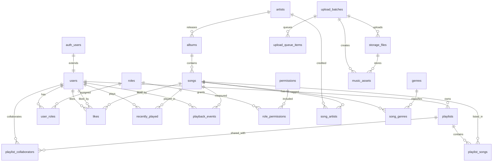

# Complete Database Schema - Spotify Clone

## 1. Architectural Blueprint

This schema implements a production-ready Supabase PostgreSQL database for a Spotify clone with:

- **Core Catalog**: Artists, Albums, Songs, Genres with full-text search
- **User Management**: Extended auth.users with profiles, roles, and permissions
- **Playlist System**: Private/public/collaborative playlists with ordered songs
- **Playback Tracking**: Likes, recently played, and playback events
- **Upload Pipeline**: Music asset processing, validation, and storage
- **Security**: Row Level Security (RLS) with RBAC policies

## 2. ER Diagram



## 3. Relational Mapping

| Entity | Cardinality | Target | Junction Table |
|--------|-------------|--------|----------------|
| User → Playlists | One-to-Many | CASCADE | - |
| User → Roles | Many-to-Many | CASCADE | user_roles |
| Role → Permissions | Many-to-Many | CASCADE | role_permissions |
| Artist → Albums | One-to-Many | SET NULL | - |
| Artist → Songs | Many-to-Many | CASCADE | song_artists |
| Album → Songs | One-to-Many | SET NULL | - |
| Song → Genres | Many-to-Many | CASCADE | song_genres |
| User → Playlists | Many-to-Many | CASCADE | playlist_collaborators |
| Playlist → Songs | Ordered Many-to-Many | CASCADE | playlist_songs |
| User → Songs | Many-to-Many | CASCADE | likes |

## 4. Master SQL Script

```sql
-- ============================================================================
-- SPOTIFY CLONE - COMPLETE PRODUCTION DATABASE SCHEMA
-- ============================================================================

begin;

-- Extensions
create extension if not exists pgcrypto;
create extension if not exists citext;
create extension if not exists pg_trgm;
create extension if not exists btree_gin;

-- Private schema for internal functions
create schema if not exists app_private;

-- ============================================================================
-- ENUM TYPES
-- ============================================================================

do $$ begin
  if not exists (select 1 from pg_type where typname = 'app_role') then
    create type public.app_role as enum ('super_admin', 'admin', 'curator', 'listener');
  end if;
end $$;

do $$ begin
  if not exists (select 1 from pg_type where typname = 'playlist_visibility') then
    create type public.playlist_visibility as enum ('private', 'public', 'unlisted');
  end if;
end $$;

do $$ begin
  if not exists (select 1 from pg_type where typname = 'song_status') then
    create type public.song_status as enum (
      'draft', 'processing', 'published', 'archived', 'rejected'
    );
  end if;
end $$;

do $$ begin
  if not exists (select 1 from pg_type where typname = 'asset_status') then
    create type public.asset_status as enum (
      'discovered', 'queued', 'validating', 'valid', 'corrupted',
      'duplicate', 'uploaded', 'failed', 'skipped'
    );
  end if;
end $$;

do $$ begin
  if not exists (select 1 from pg_type where typname = 'upload_status') then
    create type public.upload_status as enum (
      'queued', 'processing', 'completed', 'failed', 'cancelled', 'partial'
    );
  end if;
end $$;

do $$ begin
  if not exists (select 1 from pg_type where typname = 'storage_file_kind') then
    create type public.storage_file_kind as enum (
      'audio', 'archive', 'extracted', 'artwork', 'report', 'log', 'temp', 'other'
    );
  end if;
end $$;

-- ============================================================================
-- TRIGGER FUNCTIONS
-- ============================================================================

create or replace function app_private.set_updated_at()
returns trigger
language plpgsql
as $$
begin
  new.updated_at = now();
  return new;
end;
$$;

create or replace function app_private.handle_new_user()
returns trigger
language plpgsql
security definer
set search_path = public, auth
as $$
begin
  insert into public.users (id, email, display_name, avatar_url)
  values (
    new.id,
    coalesce(new.email, new.id::text || '@anonymous.local'),
    coalesce(new.raw_user_meta_data ->> 'display_name', new.raw_user_meta_data ->> 'full_name'),
    new.raw_user_meta_data ->> 'avatar_url'
  )
  on conflict (id) do update
    set email = excluded.email,
        display_name = coalesce(public.users.display_name, excluded.display_name),
        avatar_url = coalesce(public.users.avatar_url, excluded.avatar_url),
        updated_at = now();

  insert into public.user_roles (user_id, role_id)
  select new.id, r.id
  from public.roles r
  where r.key = 'listener'
  on conflict do nothing;

  return new;
end;
$$;

create or replace function app_private.has_role(required_role public.app_role)
returns boolean
language sql
stable
security definer
set search_path = public
as $$
  select exists (
    select 1
    from public.user_roles ur
    join public.roles r on r.id = ur.role_id
    where ur.user_id = (select auth.uid())
      and (r.key = required_role or r.key = 'super_admin')
  );
$$;

create or replace function app_private.is_admin()
returns boolean
language sql
stable
security definer
set search_path = public
as $$
  select exists (
    select 1
    from public.user_roles ur
    join public.roles r on r.id = ur.role_id
    where ur.user_id = (select auth.uid())
      and r.key in ('admin', 'super_admin')
  );
$$;

create or replace function app_private.can_manage_playlist(target_playlist_id uuid)
returns boolean
language sql
stable
security definer
set search_path = public
as $$
  select exists (
    select 1
    from public.playlists p
    where p.id = target_playlist_id
      and p.deleted_at is null
      and p.user_id = (select auth.uid())
  )
  or exists (
    select 1
    from public.playlist_collaborators pc
    where pc.playlist_id = target_playlist_id
      and pc.user_id = (select auth.uid())
      and pc.can_edit = true
  )
  or (select app_private.is_admin());
$$;

create or replace function app_private.audit_row_change()
returns trigger
language plpgsql
security definer
set search_path = public
as $$
begin
  insert into public.audit_logs (
    actor_user_id, action, entity_table, entity_id, old_data, new_data
  )
  values (
    (select auth.uid()),
    lower(tg_op),
    tg_table_name,
    coalesce((case when tg_op = 'DELETE' then old.id else new.id end), gen_random_uuid()),
    case when tg_op in ('UPDATE', 'DELETE') then to_jsonb(old) else null end,
    case when tg_op in ('INSERT', 'UPDATE') then to_jsonb(new) else null end
  );
  return case when tg_op = 'DELETE' then old else new end;
end;
$$;

-- ============================================================================
-- CORE TABLES
-- ============================================================================

create table if not exists public.users (
  id uuid primary key references auth.users(id) on delete cascade,
  email citext not null unique,
  username citext unique,
  display_name text,
  avatar_url text,
  default_role public.app_role not null default 'listener',
  is_active boolean not null default true,
  last_seen_at timestamptz,
  created_at timestamptz not null default now(),
  updated_at timestamptz not null default now(),
  deleted_at timestamptz,
  constraint users_username_format_chk
    check (username is null or username ~* '^[a-z0-9_][a-z0-9_.-]{2,31}$')
);

create table if not exists public.roles (
  id uuid primary key default gen_random_uuid(),
  key public.app_role not null unique,
  name text not null,
  description text,
  created_at timestamptz not null default now()
);

create table if not exists public.permissions (
  id uuid primary key default gen_random_uuid(),
  key text not null unique,
  description text,
  created_at timestamptz not null default now(),
  constraint permissions_key_format_chk check (key ~ '^[a-z][a-z0-9_.:-]*$')
);

create table if not exists public.role_permissions (
  role_id uuid not null references public.roles(id) on delete cascade,
  permission_id uuid not null references public.permissions(id) on delete cascade,
  created_at timestamptz not null default now(),
  primary key (role_id, permission_id)
);

create table if not exists public.user_roles (
  user_id uuid not null references public.users(id) on delete cascade,
  role_id uuid not null references public.roles(id) on delete cascade,
  assigned_by uuid references public.users(id) on delete set null,
  assigned_at timestamptz not null default now(),
  primary key (user_id, role_id)
);

create table if not exists public.genres (
  id uuid primary key default gen_random_uuid(),
  name text not null unique,
  slug text unique,
  created_at timestamptz not null default now()
);

create table if not exists public.artists (
  id uuid primary key default gen_random_uuid(),
  name text not null,
  slug text,
  image_url text,
  bio text,
  followers_count integer not null default 0,
  verified boolean not null default false,
  search_vector tsvector generated always as (
    to_tsvector('simple', coalesce(name, '') || ' ' || coalesce(bio, ''))
  ) stored,
  created_at timestamptz not null default now(),
  updated_at timestamptz not null default now(),
  deleted_at timestamptz,
  constraint artists_followers_count_chk check (followers_count >= 0)
);

create table if not exists public.albums (
  id uuid primary key default gen_random_uuid(),
  title text not null,
  slug text,
  artist_id uuid references public.artists(id) on delete set null,
  artist text not null,
  thumbnail text not null default '/default-album.png',
  release_year integer,
  release_date date,
  label text,
  search_vector tsvector generated always as (
    to_tsvector('simple', coalesce(title, '') || ' ' || coalesce(artist, '') || ' ' || coalesce(label, ''))
  ) stored,
  created_at timestamptz not null default now(),
  updated_at timestamptz not null default now(),
  deleted_at timestamptz,
  constraint albums_release_year_chk check (release_year is null or (release_year between 1800 and 2200))
);

create table if not exists public.songs (
  id uuid primary key default gen_random_uuid(),
  title text not null,
  slug text,
  artist text not null,
  artist_id uuid references public.artists(id) on delete set null,
  album_id uuid references public.albums(id) on delete set null,
  url text not null,
  thumbnail text not null default '/default-album.png',
  duration integer not null default 0,
  track_number integer,
  disc_number integer not null default 1,
  release_date date,
  status public.song_status not null default 'published',
  is_explicit boolean not null default false,
  play_count bigint not null default 0,
  like_count bigint not null default 0,
  storage_file_id uuid references public.storage_files(id) on delete set null,
  search_vector tsvector generated always as (
    to_tsvector('simple', coalesce(title, '') || ' ' || coalesce(artist, ''))
  ) stored,
  created_at timestamptz not null default now(),
  updated_at timestamptz not null default now(),
  deleted_at timestamptz,
  constraint songs_duration_chk check (duration >= 0),
  constraint songs_disc_number_chk check (disc_number > 0),
  constraint songs_track_number_chk check (track_number is null or track_number > 0),
  constraint songs_counts_chk check (play_count >= 0 and like_count >= 0)
);

create table if not exists public.song_artists (
  song_id uuid not null references public.songs(id) on delete cascade,
  artist_id uuid not null references public.artists(id) on delete cascade,
  role text not null default 'primary',
  position integer not null default 1,
  created_at timestamptz not null default now(),
  primary key (song_id, artist_id, role),
  constraint song_artists_position_chk check (position > 0)
);

create table if not exists public.song_genres (
  song_id uuid not null references public.songs(id) on delete cascade,
  genre_id uuid not null references public.genres(id) on delete cascade,
  created_at timestamptz not null default now(),
  primary key (song_id, genre_id)
);

create table if not exists public.playlists (
  id uuid primary key default gen_random_uuid(),
  user_id uuid not null references public.users(id) on delete cascade,
  name text not null,
  description text,
  thumbnail text,
  is_public boolean not null default false,
  visibility public.playlist_visibility not null default 'private',
  is_collaborative boolean not null default false,
  search_vector tsvector generated always as (
    to_tsvector('simple', coalesce(name, '') || ' ' || coalesce(description, ''))
  ) stored,
  created_at timestamptz not null default now(),
  updated_at timestamptz not null default now(),
  deleted_at timestamptz,
  constraint playlists_name_length_chk check (char_length(trim(name)) between 1 and 120)
);

create table if not exists public.playlist_collaborators (
  playlist_id uuid not null references public.playlists(id) on delete cascade,
  user_id uuid not null references public.users(id) on delete cascade,
  can_edit boolean not null default true,
  invited_by uuid references public.users(id) on delete set null,
  created_at timestamptz not null default now(),
  primary key (playlist_id, user_id)
);

create table if not exists public.playlist_songs (
  id uuid primary key default gen_random_uuid(),
  playlist_id uuid not null references public.playlists(id) on delete cascade,
  song_id uuid not null references public.songs(id) on delete cascade,
  added_by uuid references public.users(id) on delete set null,
  added_at timestamptz not null default now(),
  position integer not null,
  unique (playlist_id, song_id),
  unique (playlist_id, position),
  constraint playlist_songs_position_chk check (position >= 0)
);

create table if not exists public.likes (
  id uuid primary key default gen_random_uuid(),
  user_id uuid not null references public.users(id) on delete cascade,
  song_id uuid not null references public.songs(id) on delete cascade,
  liked_at timestamptz not null default now(),
  unique (user_id, song_id)
);

create table if not exists public.recently_played (
  id uuid primary key default gen_random_uuid(),
  user_id uuid not null references public.users(id) on delete cascade,
  song_id uuid not null references public.songs(id) on delete cascade,
  played_at timestamptz not null default now(),
  progress_seconds integer,
  context jsonb not null default '{}'::jsonb,
  constraint recently_played_progress_chk check (progress_seconds is null or progress_seconds >= 0)
);

create table if not exists public.playback_events (
  id uuid primary key default gen_random_uuid(),
  user_id uuid references public.users(id) on delete set null,
  song_id uuid references public.songs(id) on delete set null,
  event_type text not null,
  position_seconds integer,
  device_id text,
  room_id text,
  metadata jsonb not null default '{}'::jsonb,
  created_at timestamptz not null default now(),
  constraint playback_events_position_chk check (position_seconds is null or position_seconds >= 0)
);

-- ============================================================================
-- INDEXES
-- ============================================================================

create index if not exists users_email_idx on public.users (email);
create index if not exists users_username_idx on public.users (username) where deleted_at is null;
create index if not exists artists_name_trgm_idx on public.artists using gin (name gin_trgm_ops) where deleted_at is null;
create index if not exists artists_search_idx on public.artists using gin (search_vector);
create index if not exists albums_artist_idx on public.albums (artist_id) where deleted_at is null;
create index if not exists albums_title_trgm_idx on public.albums using gin (title gin_trgm_ops) where deleted_at is null;
create index if not exists albums_search_idx on public.albums using gin (search_vector);
create index if not exists songs_artist_idx on public.songs (artist);
create index if not exists songs_artist_id_idx on public.songs (artist_id) where deleted_at is null;
create index if not exists songs_album_id_idx on public.songs (album_id) where deleted_at is null;
create index if not exists songs_status_created_idx on public.songs (status, created_at desc) where deleted_at is null;
create index if not exists songs_search_idx on public.songs using gin (search_vector);
create index if not exists songs_title_trgm_idx on public.songs using gin (title gin_trgm_ops) where deleted_at is null;
create index if not exists playlists_user_idx on public.playlists (user_id, created_at desc) where deleted_at is null;
create index if not exists playlists_public_idx on public.playlists (is_public, created_at desc) where deleted_at is null;
create index if not exists playlists_search_idx on public.playlists using gin (search_vector);
create index if not exists playlist_songs_playlist_position_idx on public.playlist_songs (playlist_id, position);
create index if not exists playlist_songs_song_idx on public.playlist_songs (song_id);
create index if not exists likes_user_idx on public.likes (user_id, liked_at desc);
create index if not exists likes_song_idx on public.likes (song_id);
create index if not exists recently_played_user_idx on public.recently_played (user_id, played_at desc);

-- ============================================================================
-- RLS POLICIES
-- ============================================================================

do $$ declare table_name text; begin
  foreach table_name in array array[
    'users', 'roles', 'permissions', 'role_permissions', 'user_roles',
    'artists', 'albums', 'genres', 'songs', 'song_artists', 'song_genres',
    'playlists', 'playlist_collaborators', 'playlist_songs', 'likes',
    'recently_played', 'playback_events'
  ] loop
    execute format('alter table public.%I enable row level security', table_name);
  end loop;
end $$;

create policy if not exists users_select on public.users for select to authenticated
  using ((select auth.uid()) = id or (select app_private.is_admin()));

create policy if not exists users_update_own on public.users for update to authenticated
  using ((select auth.uid()) = id or (select app_private.is_admin()))
  with check ((select auth.uid()) = id or (select app_private.is_admin()));

create policy if not exists public_read_artists on public.artists for select to anon, authenticated
  using (deleted_at is null);

create policy if not exists admin_write_artists on public.artists for all to authenticated
  using ((select app_private.is_admin()))
  with check ((select app_private.is_admin()));

create policy if not exists public_read_songs on public.songs for select to anon, authenticated
  using (deleted_at is null and status = 'published');

create policy if not exists admin_write_songs on public.songs for all to authenticated
  using ((select app_private.is_admin()))
  with check ((select app_private.is_admin()));

create policy if not exists playlists_select on public.playlists for select to anon, authenticated
  using (
    deleted_at is null
    and (
      is_public = true
      or visibility in ('public', 'unlisted')
      or ((select auth.uid()) is not null and user_id = (select auth.uid()))
      or (select app_private.is_admin())
    )
  );

create policy if not exists playlists_insert on public.playlists for insert to authenticated
  with check (user_id = (select auth.uid()) or (select app_private.is_admin()));

create policy if not exists likes_own on public.likes for all to authenticated
  using (user_id = (select auth.uid()) or (select app_private.is_admin()))
  with check (user_id = (select auth.uid()) or (select app_private.is_admin()));

create policy if not exists recently_played_own on public.recently_played for all to authenticated
  using (user_id = (select auth.uid()) or (select app_private.is_admin()))
  with check (user_id = (select auth.uid()) or (select app_private.is_admin()));

-- ============================================================================
-- TRIGGERS
-- ============================================================================

do $$ declare table_name text; begin
  foreach table_name in array array['users', 'artists', 'albums', 'songs', 'playlists'] loop
    execute format('
      drop trigger if exists set_%I_updated_at on public.%I;
      create trigger set_%I_updated_at
      before update on public.%I
      for each row execute function app_private.set_updated_at()',
      table_name, table_name, table_name, table_name);
  end loop;
end $$;

drop trigger if exists on_auth_user_created on auth.users;
create trigger on_auth_user_created
  after insert on auth.users
  for each row execute function app_private.handle_new_user();

-- ============================================================================
-- DEFAULT DATA & PERMISSIONS
-- ============================================================================

insert into public.roles (key, name, description) values
  ('super_admin', 'Super Admin', 'Full system ownership'),
  ('admin', 'Admin', 'Operational administrator'),
  ('curator', 'Curator', 'Catalog management'),
  ('listener', 'Listener', 'Default user')
on conflict (key) do nothing;

grant usage on schema public to anon, authenticated, service_role;
grant usage on schema app_private to authenticated, service_role;
grant execute on function app_private.has_role(public.app_role) to authenticated, service_role;
grant execute on function app_private.is_admin() to authenticated, service_role;

grant select on public.artists, public.albums, public.genres, public.songs,
  public.song_artists, public.song_genres to anon, authenticated;
grant select, insert, update, delete on public.playlists, public.playlist_songs,
  public.likes, public.recently_played to authenticated;

commit;
```

## 5. Deployment & Validation Suite

### Execution Steps
1. Open Supabase SQL Editor
2. Paste the entire Master SQL Script
3. Click "Run" and wait for completion
4. Verify no errors in output

### Verification Queries

```sql
-- Verify extensions
SELECT extname FROM pg_extension WHERE extname IN ('pgcrypto', 'citext', 'pg_trgm');

-- Verify tables exist
SELECT tablename FROM pg_tables WHERE schemaname = 'public';

-- Verify RLS enabled
SELECT tablename, rowsecurity FROM pg_tables WHERE schemaname = 'public';

-- Verify policies
SELECT * FROM pg_policies LIMIT 10;

-- Verify triggers
SELECT tgname, tgrelid::regclass FROM pg_trigger WHERE tgname LIKE 'set_%_updated_at';
```

### Post-Deployment Checklist
- [ ] All extensions installed
- [ ] All tables created with correct columns
- [ ] RLS enabled on all tables
- [ ] Policies applied correctly
- [ ] Triggers created
- [ ] Default roles inserted
- [ ] Permissions granted