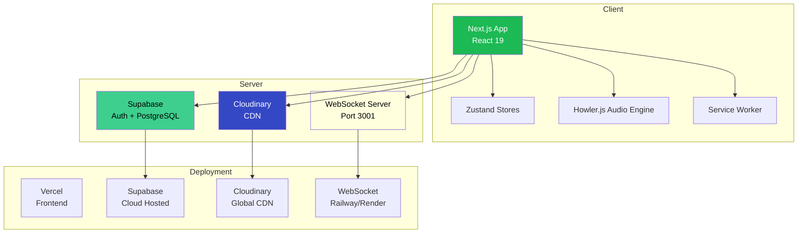

# Architecture Documentation

## System Overview

The Spotify Clone is a full-stack web application following modern client-server architecture with real-time capabilities.

## Architecture Diagram



## Component Architecture

### Frontend

```
app/                    # Next.js App Router
├── (auth)/             # Auth routes (login, signup)
├── api/                # API routes (Supabase proxies)
├── playlist/[id]/      # Dynamic playlist pages
├── album/[id]/         # Dynamic album pages
├── search/             # Search page
├── library/            # Library page
└── page.tsx            # Home page

components/            # Reusable UI components
├── Layout.tsx         # Main layout wrapper
├── Sidebar.tsx        # Navigation sidebar
├── Player.tsx         # Audio player bar
├── SongCard.tsx       # Song list item
├── PlaylistCard.tsx   # Playlist grid card
├── QueuePanel.tsx     # Queue sidebar
├── Waveform.tsx       # Audio visualization
└── Providers.tsx      # React context providers

store/                 # Zustand stores
├── playerStore.ts     # Player state
├── uiStore.ts         # UI state (modals, navigation)
└── authStore.ts       # Auth state

hooks/                 # Custom React hooks
├── useWebSocket.ts    # WebSocket connection
└── useServiceWorker.ts # PWA registration

lib/                   # Utilities
├── supabase/
│   ├── client.ts      # Browser client
│   ├── server.ts      # SSR client
│   ├── database.types.ts
│   └── queries.ts     # DB query functions
└── utils/
    └── helpers.ts     # Helper functions
```

### Backend

```
Supabase (BaaS)
├── PostgreSQL         # Primary database
├── Auth               # User authentication
├── Storage            # Optional: file storage
└── Realtime           # Optional: real-time events

WebSocket Server
├── Connection Handler # New client connections
├── Room Manager      # Room-based sync
├── Event Router      # Route messages
└── Broadcast Engine  # Send to connected clients

Cloudinary
├── Media CDN         # Global image/audio delivery
├── Upload API        # Admin upload endpoint
└── Transformations   # On-the-fly image resizing
```

## Data Flow

### Playback Flow

```
User clicks play
    ↓
Player component dispatches play action
    ↓
Zustand playerStore updates (isPlaying = true)
    ↓
Howler.js instance plays audio
    ↓
WebSocket emits 'play' event to room
    ↓
Other tabs/clients receive 'play' event
    ↓
Their playerStore syncs state
    ↓
Audio starts playing in sync
```

### Search Flow

```
User types query
    ↓
Debounced (300ms)
    ↓
API call to searchSongs()
    ↓
Supabase query with ILIKE
    ↓
Results returned
    ↓
State updated
    ↓
UI re-renders with results
```

### Auth Flow

```
User submits credentials
    ↓
Supabase Auth signInWithPassword()
    ↓
JWT tokens received
    ↓
Stored in Zustand authStore (persisted)
    ↓
Session cookie set
    ↓
Redirect to home page
    ↓
Protected routes check auth status
```

## State Management Architecture

### Zustand Patterns

```
Player Store (playerStore.ts)
├── State: currentSong, queue, isPlaying, volume, etc.
├── Actions: play(), pause(), seekTo(), etc.
├── Persistence: local storage (volume, shuffle, repeat)
└── Side Effects: Howler.js integration

UI Store (uiStore.ts)
├── State: currentView, modals, search state
├── Actions: navigation, modal control
└── Persistence: none (ephemeral UI state)

Auth Store (authStore.ts)
├── State: user, session, isAuthenticated
├── Actions: signOut(), refreshSession()
└── Persistence: local storage (session data)
```

## Real-Time Sync

### Room-Based Architecture

Each "room" represents a playback session. Clients join the same room to sync state.

**Room Data:**
- `currentSong`: Currently playing track ID
- `currentPosition`: Playback position in seconds
- `isPlaying`: Boolean playback state

**Message Types:**
- `join`: Enter room, get current state
- `play`: Start playback
- `pause`: Pause playback
- `seek`: Jump to position
- `track_change`: Skip to next/previous
- `queue_update`: Queue has changed

### Conflict Resolution

When conflicts occur (e.g., two users try to change song):
- Last write wins (timestamp-based)
- UI shows who is "now playing" via userId

## Caching Strategy

### Service Worker Caching

**Cache Names:**
- `spotify-audio`: Audio files (MP3)
- `spotify-images`: Thumbnails, album art
- `spotify-api`: API responses (optional)

**Cache Strategy:**
- Audio: Cache-first with network fallback
- Images: Cache-first with network fallback
- API: Network-first (for fresh data)

### IndexedDB (Future)

For offline playback:
- Store audio blobs
- Store metadata
- Queue management offline

## Performance Strategy

### Code Splitting

```typescript
// Dynamic imports for heavy components
const Waveform = dynamic(() => import('@/components/Waveform'), {
  loading: () => <p>Loading...</p>,
  ssr: false, // Waveform uses browser-only APIs
});
```

### Image Optimization

```typescript
import Image from 'next/image';

<Image
  src={thumbnail}
  alt={song.title}
  width={200}
  height={200}
  loading="lazy"
  placeholder="blur"
/>
```

### Audio Optimization

- Stream audio via HTML5 Audio (not loading entire file)
- Use appropriate bitrates (128-320 kbps)
- Preload next track in queue
- Enable background play on mobile

## Security Architecture

### Authentication

```
┌─────────┐     ┌──────────────┐     ┌──────────────┐
│ Client  │────▶│ Supabase Auth│────▶│ PostgreSQL   │
│ (JWT)   │     │   Session    │     │  users table │
└─────────┘     └──────────────┘     └──────────────┘
     │                  │                     │
     │ Access Token     │                     │
     ▼                  ▼                     ▼
┌─────────┐     ┌──────────────┐     ┌──────────────┐
│ API/RSC │────▶│  Auth Header │────▶│  RLS Check   │
│ Routes  │     │ Validation   │     │ (user_id)    │
└─────────┘     └──────────────┘     └──────────────┘
```

### Data Protection

- **RLS**: All tables have Row Level Security policies
- **Input Validation**: Zod schemas (future)
- **SQL Injection Prevention**: Supabase SDK parameterized queries
- **XSS Prevention**: React escapes by default, sanitize dangerous input
- **CSRF Protection**: SameSite cookies, CSRF tokens (future)

### Network Security

- HTTPS only (enforced in production)
- CORS restricted to domain
- WebSocket uses wss:// in production
- No sensitive data in URLs

## Deployment Architecture

### Vercel Deployment

```
GitHub Repository
       │
       │ push
       ▼
   GitHub Actions
       │
       ├──▶ Lint & TypeCheck
       ├──▶ Test
       ├──▶ Build
       └──▶ Security Scan
       │
       ▼
   Vercel CLI
       │
       ▼
   Vercel Platform
       │
       ├──▶ Edge Network (CDN)
       ├──▶ Serverless Functions
       └──▶ Preview Deployments
```

### Environment Separation

| Environment | URL | Database | Purpose |
|------------|-----|----------|---------|
| Development | localhost:3000 | Local Supabase | Feature development |
| Staging | preview.vercel.app | Dev Supabase | QA testing |
| Production | spotify-clone.vercel.app | Production Supabase | Live users |

### Monitoring & Logging

- Vercel Analytics (frontend)
- Supabase Logs (database + auth)
- Sentry (error tracking, future)
- LogRocket (session replay, future)

## Scalability Considerations

### Horizontal Scaling

- **Frontend**: Vercel edge network scales automatically
- **Database**: Supabase scales vertically; add read replicas for heavy load
- **WebSocket**: Move to dedicated server (Railway/Render) with Redis pub/sub for room state

### Performance at Scale

- Implement Redis caching for popular queries
- Use Supabase CDN for static assets
- Optimize images with Cloudinary transformations
- Implement pagination for large playlists (>1000 songs)
- WebSocket room sharding for many concurrent users

## Future Architecture Extensions

### Microservices (when needed)

```
┌─────────────┐     ┌──────────────┐     ┌──────────────┐
│  API Gateway │────▶│ Recommendation│────▶│ ML Service   │
│  (Next.js)   │     │    Service   │     │ (Python)     │
└─────────────┘     └──────────────┘     └──────────────┘
       │
       ├──▶ User Service (Auth)
       ├──▶ Playlist Service
       ├──▶ Search Service (Meilisearch)
       └──▶ Analytics Service
```

### Mobile Apps

- React Native frontend
- Same Supabase backend
- Shared TypeScript types
- Expo for easy deployment

---

**Last Updated:** 2026-05-03
**Maintainer:** Kilo AI Systems
