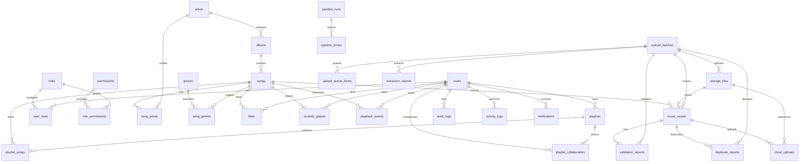

# Production Database ER Diagram

## Key Tables

- `users`: Supabase Auth profile extension linked to `auth.users`.
- `roles`, `permissions`, `user_roles`, `role_permissions`: database-backed RBAC. Authorization uses DB rows, not user-editable JWT metadata.
- `artists`, `albums`, `songs`, `genres`, `song_artists`, `song_genres`: normalized music catalog with compatibility fields used by the current UI.
- `playlists`, `playlist_songs`, `playlist_collaborators`: private/public/collaborative playlist model.
- `likes`, `recently_played`, `playback_events`: listener behavior and analytics.
- `music_assets`, `upload_batches`, `upload_queue_items`, `extraction_reports`, `validation_reports`, `duplicate_reports`, `cloud_uploads`, `storage_files`: admin upload and asset pipeline persistence.
- `pipeline_runs`, `pipeline_errors`: local watcher/CLI run reporting.
- `audit_logs`, `activity_logs`, `notifications`, `system_settings`: operational observability and configuration.

## Referential Rules

- Deleting an Auth user cascades to `users`, playlists, likes, recent history, and collaborator rows.
- Catalog content is soft deleted with `deleted_at`; destructive deletes are reserved for service-role/admin maintenance.
- Songs keep nullable references to artists/albums/storage files so catalog metadata can survive artist/album cleanup.
- Upload batches cascade to queue/report rows but not to final catalog records.

## Realtime Tables

The migration adds these tables to `supabase_realtime`:

- `upload_batches`
- `upload_queue_items`
- `notifications`
- `playlist_songs`

These are the surfaces where live UI updates are useful without flooding clients with high-volume analytics events.
